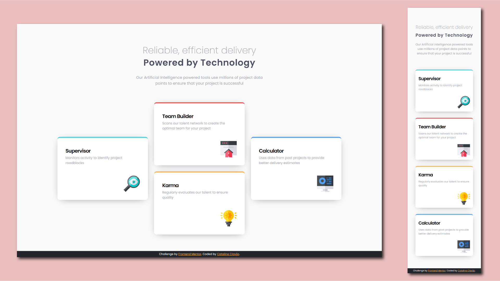

# Frontend Mentor - Four card feature section
## HTML - CSS - Responsive

This is a solution to the [Four card feature section challenge on Frontend Mentor](https://www.frontendmentor.io/challenges/four-card-feature-section-weK1eFYK).

## Screenshot

### Links

- Live Site URL: [...](...)

## Built with

- Semantic HTML5 markup
- [CSS custom properties](https://devdocs.io/css/)
- [CSS Grid](https://devdocs.io/css/grid)
- Responsive

## Author

- Frontend Mentor - [@Cataclas](https://www.frontendmentor.io/profile/Cataclas)
- GitHub - [Cataclas](https://github.com/Cataclas)